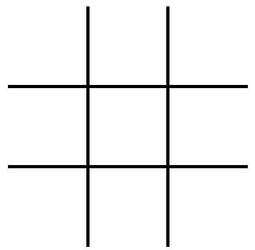
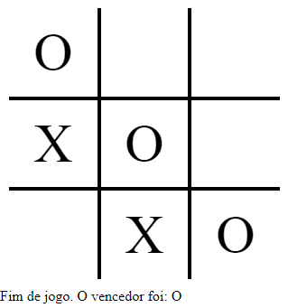

# Tic-Tac-Toe

* A Tic-Tac-Toe game based on JavaScript language;
* I used HTML and CSS for markup and styling;
* You can test this by downloading the files and opening the index.html file.

### start setup

### endgame setup

